<div align="center">

<br>

# 🧭 Pathfinder

### Map the codebase&nbsp; ·&nbsp; Pick the path&nbsp; ·&nbsp; Forge the goal

<br>

<p>


</p>

<p>
<a href="https://github.com/chrisduvillard/pathfinder-skill/actions/workflows/manifests.yml"></a>
<a href="https://github.com/chrisduvillard/pathfinder-skill/actions/workflows/codeql.yml"></a>
<a href="https://scorecard.dev/viewer/?uri=github.com/chrisduvillard/pathfinder-skill"></a>
</p>

<p><b>Drop it on any unfamiliar repo — get back a bounded goal you can run,<br>or the reviewed pull requests themselves.</b></p>

</div>

<br>

Pathfinder is a small **agent skill** for **Claude Code** and **Codex**. It reads a codebase from the source up, ranks the highest-value next moves, asks a few sharp questions, and forges a bounded, verifiable **`/goal`** you can run or hand to another agent — or, once it understands your intent deeply enough, runs the work itself and lands reviewable pull requests.

No micro-managing exploration. No guessing where to start.

<br>

## 🚀 Install

**Claude Code**

```text
/plugin marketplace add chrisduvillard/pathfinder-skill
/plugin install pathfinder@pathfinder
/pathfinder
```

**Codex**

```bash
codex plugin marketplace add chrisduvillard/pathfinder-skill
codex plugin add pathfinder@pathfinder
# then run /skills, or type $pathfinder to invoke it
```

> [!NOTE]
> Prefer no plugin system? Copy `skills/pathfinder/` into `~/.claude/skills/` (Claude Code) or `~/.codex/skills/` (Codex). Full notes in [`README-INSTALL.md`](README-INSTALL.md).

<br>

## 🧭 Three ways to use it

Bare **`/pathfinder`** opens a chooser so you can see every path before anything starts. All three build toward the same bounded, self-proving `/goal`.

| | Reach for it when | Kick it off with |
|:--|:--|:--|
| 🗺️ **Explore** | you're new to the repo and want the best next move | `Use the pathfinder skill on this repository.` |
| 🎯 **Prompt&#8209;to&#8209;goal** | you already know the task | `Pathfinder, turn this into a /goal: <the work>` |
| ⚡ **Autonomous**<br><sub>*(clarity-gated)*</sub> | you want it done hands-off | `Run Pathfinder autonomously on this repository.` |

<br>

**🗺️ Explore** reads the code itself — never the README, so a stale or missing doc can't mislead it — ranks the moves, adversarially verifies the top ones, captures your intent (the charter + clarity gate), asks a few sharp questions, then forges the goal:

```mermaid
flowchart LR
    A["<b>1 · DISCOVER</b><br/><i>read code, not docs</i>"]
    B["<b>2 · SCOUT</b><br/><i>brief each domain</i>"]
    C["<b>3 · SYNTHESIZE</b><br/><i>rank the next moves</i>"]
    V["<b>4 · VERIFY</b><br/><i>adversarially re-check</i>"]
    G["<b>5 · CHARTER</b><br/><i>capture intent · clarity gate</i>"]
    D["<b>6 · ASK</b><br/><i>a few sharp questions</i>"]
    E["<b>7 · FORGE /goal</b><br/><i>bounded · proven · ready</i>"]

    A --> B --> C --> V --> G --> D --> E

    classDef step fill:#0F172A,stroke:#2DD4BF,stroke-width:2px,color:#E6EDF3;
    classDef gate fill:#0F172A,stroke:#A78BFA,stroke-width:2px,color:#DDD6FE;
    classDef forge fill:#0F172A,stroke:#F59E0B,stroke-width:2px,color:#FBBF24;
    class A,B,C,V step;
    class G gate;
    class E forge;
```



**🎯 Prompt-to-goal** skips the full sweep and researches only what your prompt touches, then forges the same bounded goal:

```text
Pathfinder, turn this into a /goal: stop the dashboard empty-state from crashing when the API returns no rows
```

**⚡ Autonomous** kicks in only once the **clarity gate** resolves — Pathfinder has interviewed you into a doubt-free picture of the project (saved as its charter + roadmap) and each goal clears a model-depth proof gate. Then it runs the loop hands-off: **branch → implement → verify → commit → push → open a PR → self-merge** eligible work where the repo allows, landing anything that needs sign-off as an awaiting-review PR and continuing until the work is done, blocked, unsafe, or out of budget. It never escalates on a fresh repo or while any doubt remains. → [Safety](#-safety)

<br>

## ✨ What a run looks like

You say:

```text
Use the pathfinder skill on this repository. Start the full Pathfinder process.
```

Pathfinder maps the repo and hands back a route:

```text
Best next move : fix the dashboard empty-state crash
Scope          : dashboard data loading and tests only
Proof          : regression test passes, typecheck passes, changed files listed
Goal           : /goal Fix the dashboard empty-state crash so users see a useful
                 empty state instead of a blank page; npm test exits 0; tsc clean;
                 no schema change; between loops note what changed and pick the next
                 fix; stop after 12 turns, then report the blocker and next input needed.
```

That `/goal` is **bounded, measurable, and self-proving** — paste it into Claude Code or Codex and it works toward the condition across turns until it holds.

<br>

## 📦 What you get

Every run leaves a clean, resumable trail inside the repo:

```text
.agent-work/pathfinder/<date>-<task>/
├─ 00-session.md              repo root, branch, tooling, objective
├─ 01-blind-discovery.md      what the repo actually is
├─ 02-scout-briefs/           located, evidence-graded findings per domain
├─ 03-synthesis.md            ranked next moves + risks
├─ 03b-verification.md        adversarial check of the Top 5 (grades, rejects, re-rank)
├─ 04-question-funnel.md      the choices put to you
├─ 05-user-answers.md         what you picked
├─ 06-goal-command.md         a ready-to-copy /goal or grouped goal pack
├─ 07-run-log.md              progress if the goal is run
├─ 07b-cross-model-review.md  optional second-model review packet
└─ 08-final-summary.md        what was explored, found, and decided
```

Two private files persist across runs — **`.pathfinder/charter.md`** (stable intent) and **`.pathfinder/roadmap.md`** (evolving work). Both are gitignored via `.git/info/exclude`, never committed, and sanitized on every read.

<br>

## 🔒 Safety

Every repo file is treated as **untrusted data**. Pathfinder won't run scripts, install packages, read secrets, or push changes without your say-so, and it redacts tokens and private paths from its artifacts.

Autonomous mode is the one path that commits and merges without a per-step prompt. Even then:

- 🚫 **Dangerous categories are never auto-touched** — auth, payments, migrations, secrets, CI, public APIs, network egress — filtered out before work *and* hard-blocked on the real diff.
- 🧱 **The trust boundary holds** — repo content can't redirect the goal or widen authorization.
- 🔑 **Credentials stay out** of the environment while repo code runs.
- ✅ **Self-merge is default-deny** — only on a positive branch-protection signal; anything that needs review lands as an awaiting-review PR.
- 🛑 **Doubt blocks autonomy** — no escalation on a fresh repo or while any blocking question is open.

<br>

## 🔬 Under the hood

<details>
<summary><b>How it ranks, verifies, and proves work</b></summary>

<br>

- **Reads the source, not the docs.** Five domain scouts (architecture, frontend/product, backend/data, testing/reliability, DX/security) produce located, evidence-graded findings, synthesized into a ranked **Top 5** by impact ÷ effort (`confirmed > inferred > suspected`).
- **Adversarial verification.** A blind **three-verifier panel** re-checks every Top-5 candidate, downgrades or rejects the weak ones, and surfaces a `Verified:` grade — so you act on confirmed work, not a hunch.
- **Pick the work your way.** Choose from ranked candidate cards, drill down *intent → domain → surface → target → boundaries*, or select several moves as a numbered **goal pack**.
- **Proof bound to the goal.** Each goal records a Goal Binding; run logs and summaries record the Runtime Boundary and Binding Status, so "done" is checked against the original objective instead of drifting into looks-done prose.
- **Optional cross-model review.** After a run, Pathfinder can hand the goal, diff, and checks to the opposite local tool (Claude ⇄ Codex) for goal-bounded fixes — recorded in `07b-cross-model-review.md`, or a manual handoff packet if no launcher is available.

</details>

<details>
<summary><b>How it learns your intent (the charter)</b></summary>

<br>

On first use, Pathfinder asks 8–12 compact questions — purpose, users, success, constraints, non-goals, finished state, autonomy policy, and future capabilities not started yet — and keeps asking until no blocking doubt remains (the **clarity gate**). It saves stable intent to `.pathfinder/charter.md` and evolving work to `.pathfinder/roadmap.md`. Later runs reuse both, show their influence, reconcile them against the current code, and let you refresh or override with `/pathfinder charter`.

</details>

<details>
<summary><b>Checking state without starting work</b></summary>

<br>

Run `/pathfinder status` (or *"Show Pathfinder status."*) for a read-only look at safe local state — repo/branch, whether the charter and roadmap exist and are complete, the latest run, and the available paths — without creating artifacts or triggering the interview.

</details>

<br>

## 🤝 Contributing & support

Contributions are welcome when they keep Pathfinder **safe, bounded, and easy to run** on unfamiliar repos. Start with [`CONTRIBUTING.md`](CONTRIBUTING.md); get usage help in [`SUPPORT.md`](SUPPORT.md); report vulnerabilities privately via [`SECURITY.md`](SECURITY.md), not public issues. Version and changelog live in [`VERSION.md`](VERSION.md).

<sub>CI guards manifest/version consistency, CodeQL scanning, OpenSSF Scorecard, and dependency review.</sub>

<br>

<div align="center">

**Map the codebase&nbsp; ·&nbsp; Pick the path&nbsp; ·&nbsp; Forge the goal**

<sub>MIT licensed · built for Claude Code and Codex</sub>

</div>
